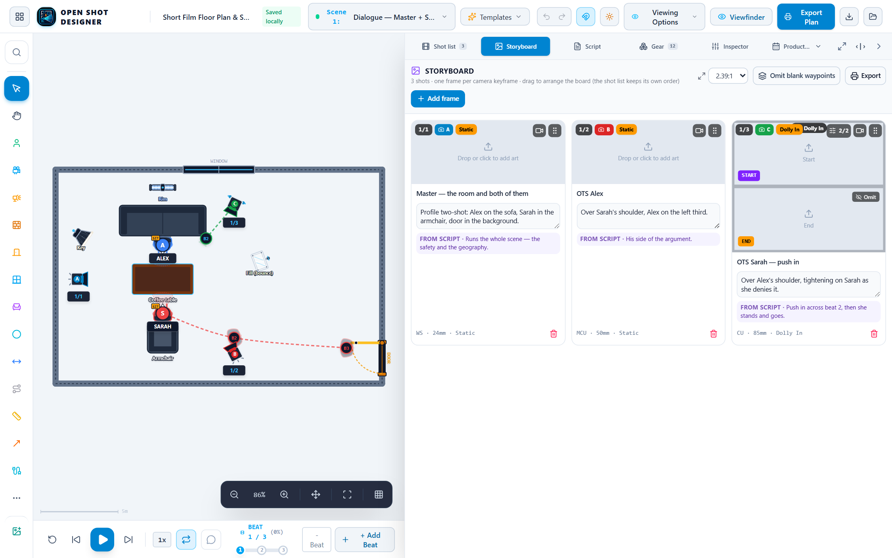
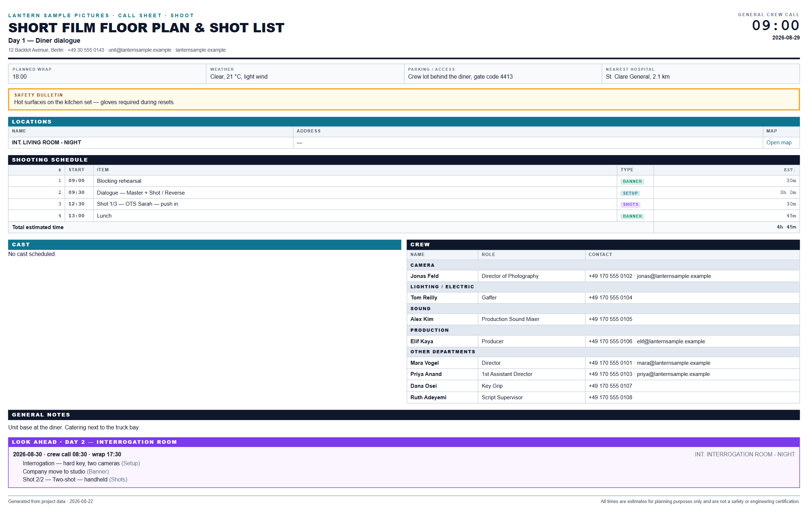
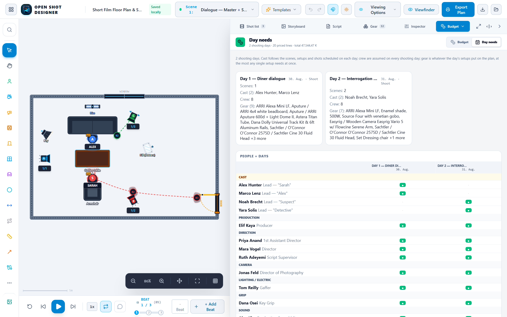
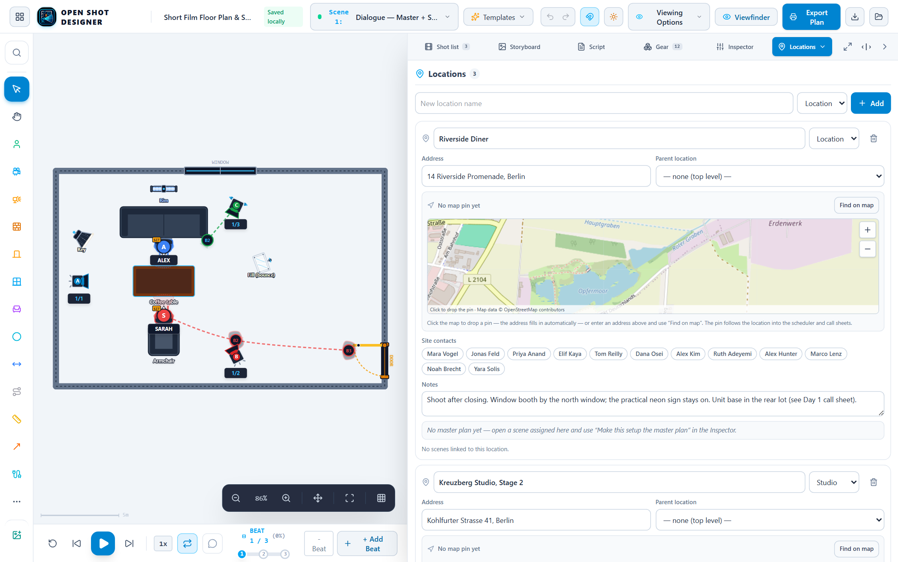
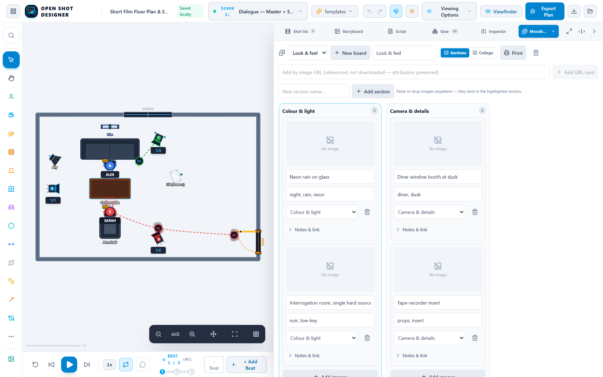
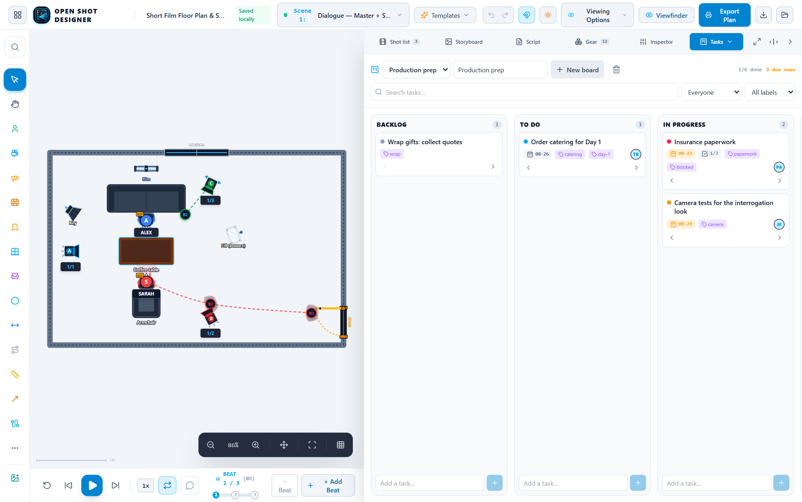
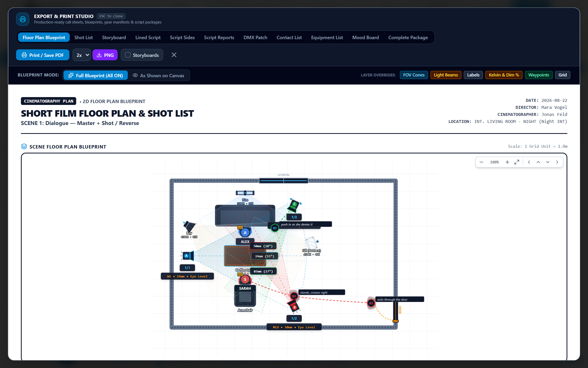

# Open Shot Designer

<div align="center">


[](CHANGELOG.md)
[](https://github.com/sponsors/koosoli)
[](https://buymeacoffee.com/koosoli)
[](https://koosoli.github.io/OpenShotDesigner/)
[](LICENSE)

</div>

> **Self-hosted fork.** This build can keep projects on your own server instead of in one browser, so every device sees the same library. See **[SELF-HOSTING.md](SELF-HOSTING.md)** (Docker / TrueNAS / reverse proxy + Authentik).

A free, open-source production planning suite for directors, DPs, ADs and script supervisors: **lined script**, **floor plan**, **shot list**, **storyboard** and **equipment manifest**, plus **scheduling**, **call sheets**, **crew and cast**, **budget**, **locations**, **task board**, **mood boards**, **logistics**, **rigging**, **power** and an on-set **continuity log** — all in one browser tab. Import a screenplay, line it for coverage, block the scene, plan the camera moves, shoot storyboard frames with your own camera, schedule the shoot, log the takes on the day, and export production-ready paperwork. No account, no backend — everything lives in your browser.

It follows the production through the shoot, not just up to it: the continuity page logs takes against the shots you planned and exports them as a spreadsheet **DaVinci Resolve reads as clip metadata**, so the scene, shot, lens and notes land on the footage in your edit ([details](#straight-into-davinci-resolve)).

A screenplay is optional: nothing outside the script tools requires one, so concert, broadcast, event and pure technical floor plans work the same way. Nothing is entered twice either: the budget prices the crew list and the gear on the plan against the days on the schedule, every sheet that names a location gets its address from the same link, and the continuity log starts pre-filled from the plan.

**Try it live:** <https://koosoli.github.io/OpenShotDesigner/>

**Current release:** v1.0.2 — see [CHANGELOG.md](CHANGELOG.md) for release notes.

---

## How it fits together

A shot exists in four places at once, and every view edits the same thing:

| View | What it is | How it connects |
| --- | --- | --- |
| **Script** | The screenplay, lined for coverage | Each lining *is* a shot |
| **Board** | One storyboard frame per shot | Same shots, its own frame order |
| **Shot List** | The production table / coverage cards | Same shots, its own running order |
| **Floor plan** | Cameras, actors, props, lights | Each shot's camera is a position on the plan |
| **Equipment** | Production gear manifest | Cameras, lights, props & track on the plan become line items |
| **Schedule** | Stripboard, calendar, call sheets, coverage | Scenes *and* setups are schedulable; call sheets derive from the day |
| **Crew** | Crew, cast & contacts | Key roles feed the paperwork; cast link to script characters |
| **Budget** | Rates, VAT, day needs | Crew rate cards, gear on the plan and the schedule price themselves |
| **Continuity** | The take log and the day's checklist | Takes hang off the same shots; coverage is derived from them, and the log exports as Resolve clip metadata |

Line a speech in the script and a camera lands on the floor plan, a row appears in the shot list, and a frame appears on the board. Delete that camera and all three go with it.

---

## A look around

Every screenshot below is the app running the bundled example production — the
one you get by ticking **"Start with the example scenes"**, or from
**Templates → Fill empty modules with examples** in a project you already have.

### Block the scene, and the shot list writes itself


Cameras, actors, lights, props and walls on a scaled plan, with movement paths
drawn as you set them. Each camera on the plan *is* a row in the shot list — and
a lining in the script, and a frame on the board.

### Line the script for coverage


Import a screenplay, highlight what a shot covers, and the classic vertical
lining appears next to the text while a camera lands on the plan.

### Storyboard, from drawings or your own camera



One frame per shot — and one per camera keyframe, so a move is boarded at its
start, each waypoint and its end. Drop artwork in, or shoot the frame through
the simulated viewfinder with the device camera on the recce.

### The gear list builds itself from the plan


Every camera becomes an expandable package with the scene's actual lenses and
rig; lights carry their Kelvin, intensity and beam angle; track, props and
cables all appear automatically. Export as a truck manifest or a spreadsheet.

### Schedule it like an AD


A real strip board: shooting days, drag-or-tap placement from the unscheduled
pool, time estimates, meal and company-move banners, day totals and conflict
warnings. Scenes, setups *and* individual shots are all schedulable — so a
project with no screenplay schedules just as well.

### Issue the call sheet


A live paper preview with readiness warnings: crew call, locations, scheduled
cast, weather, parking, nearest hospital, safety bulletin, transport and
per-person pick-ups, and a next-day look-ahead. The shooting schedule is grouped
under scene headings the way an AD reads it — **Sc 3 · INT. LIVING ROOM - DAY** —
with each strip's scene number and location in their own columns, and each
person's pick-up on their own row. A day that moves between two places gets a
captured map per location, each labelled with the place it shows.

And this is what comes out of the printer — the same data, laid out for paper:



### Crew, cast and the key roles


Assign Director, DP, 1st AD, Gaffer and the rest by role — the same fields the
scene inspector and every export read, so they cannot drift apart. Cast link to
screenplay characters, which are detected from the script automatically.
Headshots are repositioned by dragging the picture itself, and each person
carries the rate the budget prices them by.

### The budget prices itself from the schedule


Every crew and cast member is a row with their rate on it — **per day**, **per
week** (pro-rated over the paid week) or a **flat fee** — and VAT on top at the
rate's own percentage or the production default. Luxembourg's 17 % is the
default, with its reduced rates and the neighbours' a pick away, and a
reverse-charged supplier or a salaried employee is simply 0 %.

Nothing is typed twice: gear on the plans is priced by rates keyed to the master
equipment list, and the numbers follow the schedule — a person costs the days
they are actually needed, a light the days its setup is on. Producers, director,
writers and principal cast sit **above the line** by role, overridable per
person. Anyone without a rate is listed and flagged, never quietly priced at
zero. Print it or export the CSV.

### Who and what each day needs



The production manager's morning question, answered from the schedule: per
shooting day, the scenes, the cast the day's strips resolve to, the crew, and
the gear its setups put on the plan — as cards, and as people × days and
gear × days grids.

### Power, per truss and per phase


Sources, circuits and consumers with headroom, load broken down per truss run
and per distro zone, and 3-phase leg assignment with a balance readout. Unknown
wattages stay unknown — they are never counted as zero.

### Locations, on a real map



Drop a pin and the address fills itself in, or geocode from the address. Keyless
OpenStreetMap, so it works in the static build with no API key.

### Mood boards and the task board





Boards from local files or URLs with a free-form collage and dominant-colour
palette extraction; and a kanban with due dates, priorities, checklists and crew
assignees grouped by department.

### Log the day, and tick it off

On the day the script supervisor's log and the AD's "what did we miss?" list are
the same document, so they are one page here. Log a take against a shot and the
checklist ticks itself off from the takes — nothing stores "this shot is done"
separately, so the two halves cannot disagree. At wrap it names the gaps out
loud: shots scheduled but never shot, and shots with takes but no good one.

Every field starts pre-filled with what the app already knows — the production,
the crew, the scene, the lens and camera on the plan — and you type over only
what was actually different on the day. A shot planned at 24mm but grabbed at
85mm exports as 85mm.

Nobody planned it? Log a pickup: it takes the next free number in whatever
convention the scene already uses (`1/3` → `1/4`, or `1F` → `1G`), so nothing
already on a slate is renumbered, and it is listed apart from the plan so the
shot you actually missed stays visible.

And the whole log leaves the app as clip metadata for your edit, which is the
next section.

### Straight into DaVinci Resolve

The continuity log exports a CSV that DaVinci Resolve imports as **clip
metadata** — not a report you read beside the edit, but data that lands *on* the
footage. In Resolve: **Media Pool → right-click → Import Metadata…**, pick the
file, and Resolve matches each row to a clip **by file name** and writes the
remaining 28 columns onto that clip.

So the scene, shot and take numbers, the good-take flag, the description,
comments and keywords, and the camera settings — type, FPS, shutter, ISO, white
point, lens, filter, aperture and notes — all arrive in your media pool, on the
right clips, ready to sort, filter and smart-bin by. Most of it was already in
the app from planning the shoot; the log just carries it across.

Two things make or break that import, and both fail *silently* — Resolve reports
success and attaches nothing:

- **The header names.** Resolve maps columns by header text, exactly. The
  header row this app writes is byte-identical to Resolve's own template
  (vendored at [`docs/resolve-metadata-template.csv`](docs/resolve-metadata-template.csv))
  and a test asserts it against that file, so a tidy-up can never quietly break
  the import.
- **The file names.** They are the join key, and they are the one thing nobody
  on set knows while logging — clip counters restart per card and an aborted
  take still burns a number. So they are filled *afterwards*, in a
  reconciliation pass against the card's own listing, which shows you the drift
  rather than hiding it. A log that slips by one clip would otherwise attach
  every later row to the wrong shot.

### Print the whole package



Floor plan, shot list, gear manifest, DMX patch, storyboards, lined script,
breakdown reports, sides, stripboard, coverage matrix, contact list and mood
board — in one print job, with your production logo on the paperwork.

## Features

### Projects & Setup

- **Project dashboard** — every production you have worked on in this browser, with scene and shot counts, whether it carries a screenplay, and when it was last saved. Reachable any time from the grid button in the top bar (or "All projects" in the overflow menu on small screens).
- **Instant blocking bootstrap** — every new project and scene setup immediately starts with **Camera A** and **Actor A** pre-positioned in direct line of sight with default **Shot 1 (Medium Shot)**, so you can begin blocking immediately.
- **Start with sample scenes** — tick the box to start from the bundled example scenes: a dialogue master + shot/reverse and a two-camera interrogation, complete with pre-lined screenplays.
- **Manage them** — open, rename, duplicate, download as a project file, or delete, straight from the dashboard.
- **Import lands beside your work** — importing a `.json` project file adds it as its own project instead of overwriting the one you have open.
- **Safe storage** — each project is stored under its own key, so one production with heavy embedded storyboards can't push the others out.

### Lined Script & Screenplay Suite

- **Lined Coverage view** — standard Hollywood layout (Courier, 60-column page) with fluid auto-scaling that dynamically fills available panel or fullscreen space.
- **Screenplay Editor** — write and format scripts directly inside the browser with authentic 12pt Hollywood Courier formatting.
  - **Natural Enter flow** — `Scene Heading` ➔ `Action` ➔ `Character` ➔ `Parenthetical` ➔ `Dialogue` ➔ `Action`.
  - **Smart blank conversions** — pressing <kbd>Enter</kbd> on empty cues seamlessly converts Parentheticals to Dialogue, empty Characters to Action, and empty Actions to Scene Headings.
  - **Tab cycling** — press <kbd>Tab</kbd> / <kbd>Shift+Tab</kbd> to cycle across all 6 screenplay element types.
  - **Fountain mode** — toggle between WYSIWYG Page View and raw Fountain syntax markdown code.
- **AV Script (2-Column Audio/Visual)** — dedicated production AV table for commercials, documentaries, and multicam setups. Synchronized bidirectionally with floor plan cameras and lined coverage. Prints as a sheet of its own — video down one side, audio down the other, with shot count and running time — and joins the complete package whenever it has rows.
- **Scene numbers detected automatically** — from production-draft sluglines (`8   INT. LOFT - NIGHT   8`), Fountain forced numbers (`#8A#`), or Final Draft scene attributes — and printed in **both margins**, the way a numbered production draft is read.
- **Title page** — the screenplay's cover with title, credit, author(s), source, draft, date, contact and copyright, edited beside a live preview. The fields are Fountain's standard title-page keys, so a script that arrives with a cover keeps it and an exported one carries it back out. Printing the cover is opt-in, and a **DRAFT** stamp is one toggle away (off by default).
- **Cut a scene without losing its number** — deleting a scene heading first *omits* it: the slugline stays in place as **SCENE 12 — OMITTED**, its body is parked and restored verbatim by **Restore**, and deleting it again removes it for good. Scheduled strips for an omitted scene stay visible on the board rather than vanishing, and a new scene can be started directly after an omitted one.
- **Lock the numbers when the script locks** — while you are still writing, scenes are numbered by position and renumber as you insert. One click makes them **production numbers**: a scene inserted between 3 and 4 becomes **3A** (and **3AA** between 3A and 3B), a cut scene stays in place as **OMITTED** with its number, a deleted one leaves a gap, and every other scene keeps the number the breakdown, stripboard and call sheets already quote. Numbers stay editable by hand while locked, and a script imported with production numbers already in it locks on arrival.
- **Link a scene heading to a real location** — the set a heading names ("INT. **LIVING ROOM** - NIGHT") is linked to a project location from the heading itself, so the call sheet gets its address and map pin. One link covers every scene *and* setup that names the same set, and it is changed or undone from the same control — on the heading, on the call sheet, or in the script's location report.
- **Highlight anything to make a shot** — select as little as a single word or multiple speeches; the selection creates a shot on the floor plan with classic vertical lining lines.
- **Persistent text selection** — text highlights remain active and preserved across panel interactions.
- **Adjustable coverage** — drag round handles on a selected lining to extend or shorten it, or grow it to the current selection.

### Floor plan & blocking

- **Top-down floor plan canvas** — drag actors, cameras, and props onto a scaled room; move, resize, and rotate anything.
- **Full screen overlay** — dedicated full screen toggle (`Maximize2` / `Minimize2` or <kbd>Esc</kbd> to exit) across Shot List, Storyboard Board, Script, and Inspector.
- **Waypoint animation** — set waypoints for actors, cameras, props **and lights**, add rotation per waypoint, and watch a ghost preview of the move along the path. Fixtures move too: followspots track, practicals ride a dolly, and an event rig repositions between numbers.
- **Group animation** — group any selection (right-click → Group) to rotate it rigidly around a shared pivot and animate the whole group with keyframes. The motion path draws on the plan as a dashed run with numbered, draggable keyframe dots.
- **Camera coverage** — FOV cones with configurable angle, focal length, and distance; easy match-frame blocking.
- **Storyboard thumbnails on the plan** — a shot's artwork sits beside its camera on a leader line and can be dragged anywhere on the canvas.
- **Basic shapes & architectural walls** — walls, doors, windows, rectangles, circles, ellipses, triangles, diamonds, and stars for blocking zones and callout areas.
- **Reference images** — overlay set photos or blueprints as background images with drag, resize, opacity, and visibility toggles.
- **Props & lighting** — furniture presets, light sources with beam wedges, measurement lines, and the full grip range of C-stand modifiers: solid, silk, net and cutter flags plus **cucoloris (cookie)**, **branchaloris** and **barn doors / framing shutters** with an adjustable cut angle.
- **Fixture modifier stacks** — add softboxes, lanterns, Fresnel attachments, grids/eggcrates, gels, snoots, reflectors, diffusion, and barn doors to a light. Active accessories change the shared canvas/print symbol, can override the effective beam when a real angle is known, and flow into equipment manifests.
- **Source-backed photometrics** — enter measured or manufacturer lux/foot-candles at a known distance, calculate inverse-square estimates in lux and fc, and optionally show scale-aware readings along the cone. Missing output or modifier transmission stays unknown; cone readings are off by default.
- **Streets & roads** — draw a carriageway with real width the way you draw a dolly track: straight or curved, six surfaces (asphalt, concrete, cobble, gravel, dirt, rail/tram), lane dividers, centre markings including a zebra crossing, optional pavements and a street name laid along the run.
- **Readable by default** — camera FOV cones and light beams start switched off so a fresh plan is legible; both are one toggle away in Inspector → Display.
- **Production logo** — upload a logo in the inspector's Production Details or on the call sheet; stamped on printed plans, call sheets, reports and PNG blueprints.

### Shot list

- **Cards or production table** — two views of the same list, with inline editing of shot number, name, camera, size, lens, movement, angle, takes, and status.
- **All scenes on demand** — off by default; switch it on to see and edit every scene's shots in one list, each tagged with its scene. Selecting a shot from another scene switches to it.
- **Insert between shots** — inserting after a shot always creates a *new* shot with its own camera on the floor plan (as a letter, `1A`, or with the rest renumbered) — it never overwrites the neighbouring setup.
- **Camera assignment keeps your blocking** — the CAM dropdown lists every camera letter on the floor plan (A, B, C…) plus **"+ New camera"**. Switching a shot from A to B re-letters the camera already blocked for that shot **where it stands** — the camera never respawns somewhere else, and camera B's own position is untouched. If other shots share that camera position, it is copied in place for this shot alone.
- **Synced with the canvas** — selecting a camera selects its shot, and deleting a camera removes its shots and their linings.

### Storyboard & viewfinder camera

- **A tab of its own** — "Board" sits between Shot List and Script: the scene as a wall of frames, one per shot.
- **Same data as everything else** — "Add frame" creates a shot *and* drops its camera on the floor plan; shots added in the shot list or lined from the script appear here automatically, blank until artwork is attached.
- **Artwork** — drop an image on a frame (or click it to browse), toggle fill/fit, replace, or clear it. Frames without art stay blank on purpose. Each frame also has a viewfinder button, so you can open that shot's finder and shoot the frame with the device camera.
- **A frame per camera keyframe** — a shot gets one frame for every position its camera holds: **Start**, one per waypoint (**Beat 2**, **Beat 3**…), and **End**. They sit side by side on the card with the move named above them, are boarded independently, and all of them print. Frames can be added from three places: the board, the **camera inspector** (one uploader per keyframe), or the picture button on each waypoint row. On the floor plan every frame's thumbnail hangs off the camera position it belongs to, and the viewfinder has a Frame switch (with a green dot on the keyframes already boarded) so a capture lands exactly where you mean. Adding or removing a waypoint never re-shuffles the artwork already attached.
- **Rearrange freely** — drag a frame by its handle to arrange the board. The board keeps its **own** order: rearranging frames never reshuffles the shot list.
- **Descriptions in place** — edit the shot name and description on the frame; they are the same fields the shot list and lined script show.
- **Aspect ratio** — switch the whole board between 16:9, 2.39:1, 1.85:1, 4:3, and 9:16; frames (and the storyboard thumbnails on the floor plan) reframe to match.
- **Export from the tab** — the board's Export button opens the print studio straight on the storyboard contact sheet. The Script and Shot List tabs have the same shortcut to their own export.
- **Simulated optical finder** — the framing for any camera, with rule of thirds, crosshair, 90% action / 80% title safe, and a cinema HUD.
- **Shows the storyboard** — when the shot has artwork it fills the frame (toggle it with **Board**), so the drawing and the blocking can be compared side by side.
- **Live camera** — opens the device's own camera (laptop webcam, phone or iPad, front/rear switchable) inside the frame, with every guide drawn on top. A round shutter sits on the picture; **Space** or **Enter** fires it too.
- **Freeze, then keep** — capture locks the finder on the exact moment taken (**CAPTURED FRAME**, with **Retake** to go back live) and stores it, cropped to the camera's aspect ratio, as that shot's storyboard. If the camera has no shot yet, one is created for it automatically.
- **Editable camera settings** — iris/T-stop, ISO, shutter angle (with the matching shutter speed), frame rate, ND, sensor, aspect ratio and camera height are editable from the HUD *and* from the camera inspector, and are stored per camera.
- **Photos stay small** — every storyboard image (captured, dropped, or picked from a file) is downscaled on the way in, so a phone-sized photo can't blow the browser's storage.

### Equipment manifest

- **Derived straight from the plan** — every camera letter on the floor plan becomes one expandable **Camera package** (batteries, media, monitor, wireless TX, follow focus) carrying the scene's actual lenses, rigs, and sensor; lights become fixtures with their Kelvin, intensity, and beam angle; props, dolly track, and rig systems all appear automatically.
- **Current scene or whole production** — switch between the active scene's manifest and an **All Scenes master truck package** that rolls every setup's gear into one list.
- **Spreadsheet or cards** — a production-table data grid (default) or department rubric cards, both editable inline.
- **Find anything fast** — search gear, brands, models, and packages, or filter by color-coded department (Camera, Lighting, Grip, Sound, Power & Media, Cables, Props, Expendables, Other) with live unit counts.
- **Fast Add presets** — one-click common production gear (batteries, SD cards, cables, tape, clamps…) straight into the scene, plus a full department **brand/model catalog** and camera package presets when you add custom gear.
- **Expandable kits** — camera packages open into their line items; add accessories, edit quantities, roles, and specs, or reset a scene back to the floor plan defaults.
- **Export & print** — download the manifest as an Excel/CSV spreadsheet (per scene or all scenes) or print a production-ready truck manifest from the export studio.

### Scheduling & call sheets

- **Stripboard** — an AD's strip board with shooting days, drag-or-tap placement from a searchable unscheduled pool, editable time estimates, day breaks, meal/move/rehearsal banners, per-day totals and conflict warnings.
- **Schedule what you actually have** — screenplay scenes *and* floor-plan setups are both schedulable, and so are individual shots or multi-selected shot groups, so a project with no script schedules just as well.
- **Production calendar** — a ranged timeline of prep, shoot, post and delivery, plus a month grid with event categories, status and assignees.
- **Call sheets** — a day picker with a live paper preview and readiness warnings: crew call, locations, scheduled cast, weather, parking, nearest hospital, safety bulletin, **transport and per-person pick-ups** (time, who, from where), general notes and a next-day look-ahead.
- **Read by scene, like a shooting schedule** — strips are grouped under their scene heading (**Sc 3 · INT. LIVING ROOM - DAY**), with the scene number and location in their own columns. Scenes print their real slugline; a production with no screenplay gets one built from the setup's INT/EXT, location and time of day.
- **Everyone's own line answers their own questions** — an individual call time and a transport pick-up both appear on that person's row in the cast and crew tables, not only in a block at the foot of the sheet. Giving someone a call or a pick-up also puts them on the sheet, whatever the day's scenes resolved to.
- **A map per location** — a day that moves between two places gets one captured OpenStreetMap picture per pinned location, each captioned with the place and address and carrying the name and attribution burned into the image itself, so it survives being photographed. Fetched once on an explicit press and stored with the project, so it prints and travels offline.
- **Draft until you say otherwise** — an unfinished sheet carries a DRAFT watermark on **every** printed page until the day is marked final, and cast contact numbers can be withheld from the copies left on a table.
- **Coverage matrix** — plan what every camera is responsible for at each moment. Rows follow the run-of-show cue list or are added freely; columns are discovered from the cameras on the plan.
- **Printable** — stripboard, calendar, coverage and each day's call sheet all print, with the production logo and strip colours.

### Continuity log & shooting-day checklist

- **One page, two jobs** — the take log and the day's tick-off list, because on a set they are the same job. Coverage is derived from the takes (a shot is covered when it has a good take), so the checklist can never disagree with the log.
- **The wrap gaps, named** — shots scheduled with no takes at all, and shots with takes but no good one. That list is what an AD actually wants at the end of the day.
- **Sticky columns** — a new take inherits the previous one's roll card, keywords and camera settings and increments the take number; changing shot resets it to 1. What describes only this take — file name, good/NG, comments — always starts blank, because inherited-but-wrong metadata is worse than none.
- **Every column editable** — all 29 metadata fields are settable per take, each pre-filled with what the app already knows as a placeholder. Type over it with what was *actually* shot; clear it to fall back to the plan. Nothing is copied, so fixing the shot list still fixes every take that never overrode it.
- **Unplanned shots** — log a pickup and it takes the next free number in the scene's existing convention (`1/3` → `1/4`, `1F` → `1G`); pre-existing numbers never move, because a shot number that has reached a slate or a metadata import cannot be renumbered without invalidating all of it. Provenance is a flag, not part of the number.
- **Plan vs actual stay separate** — an unplanned shot never joins the plan retroactively, or the checklist would stop being able to report the shot you actually missed.
- **File-name reconciliation** — file names are filled *after* the fact against the card's listing, not typed live: clip counters restart per card and an aborted take still burns a number, and a log that drifts by one clip attaches every later row to the wrong clip in Resolve. The pass shows the drift instead of hiding it, and can count on from the last name (`A001C002` → `A001C003`, incrementing the *clip* field, not the reel).
- **Take records** — a take carries its file name, roll card, good/NG flag, comments, keywords and any camera or slate values that differed. Deleting a shot takes its takes with it; deleting a day only unhooks them, because the footage still exists on a card.

### Crew, cast & contacts

- **Crew tab** — people with department, role, three phone numbers (work, private, production-issued), email, company, address, emergency contact and **hotel booking** (name, address, check-in/out), grouped by department.
- **Headshots** — attach a photo and frame it by dragging the picture itself in any direction, with a zoom; the framing is stored beside the image rather than baked into it, so it is reversible and two people can share one photo. Faces appear on the crew list, the contact sheet and the call sheet's cast table.
- **Rates that feed the budget** — an amount, whether it is per day, per week or a flat fee, and the VAT on top, plus a free-text note for what a number cannot say ("kit fee €120/day on top").
- **Key crew** — assign Director, DP, Producer, 1st AD, Gaffer, Key Grip, Sound Mixer and more by role. Director and DP are the same fields the scene inspector and every export use, so the two can never drift apart.
- **Cast ↔ characters** — link a performer to a screenplay character; characters are auto-detected from the attached script, and casting works with no script at all.
- **CSV in and out**, plus a printable contact list with a cast list and an accommodation table.

### Budget, rates & day needs

- **Derived, not typed twice** — the crew list, the plans and the schedule are the inputs; only rates and the costs nothing else knows about are stored. Change a shooting day and the budget follows.
- **Three ways to be paid** — per day, per week (pro-rated across the paid week, which is configurable) or a flat fee, per person and per piece of gear.
- **VAT that matches where you shoot** — a production default with Luxembourg's 17 / 14 / 8 / 3 % first and Germany, France, Belgium, the Netherlands, Austria, Switzerland, Italy, Spain, Ireland and the UK a pick away; any percentage can be typed, any single rate can override the default, and 0 % covers reverse charge and salaried crew. VAT is totalled **per rate**, the way a VAT return wants it.
- **Above and below the line** — producers, director, writers and principal cast are above the line by role, and any person can be moved either way.
- **Equipment prices itself from the plan** — a rate keyed to the master equipment list covers every day a setup using that gear is scheduled, at the peak quantity any single setup needs.
- **Hand lines for the rest** — locations, catering, travel, art, post, insurance, with quantities and their own day counts, plus a contingency percentage on the net.
- **Nothing is silently free** — a person or item with no rate is listed as unpriced rather than counted as zero, and a rate whose gear has left the plan says so instead of vanishing.
- **Day needs** — per shooting day: scenes, cast (resolved from the day's scenes, setups *and* shots), crew, and the gear its setups require, as summary cards plus people × days and gear × days grids.
- **Print or export** — a paper budget with the split, every category, VAT by rate and the unpriced list, or a CSV that opens in Excel.

### Locations, tasks, mood boards & logistics

- **Locations** — sites with type, address, notes and contacts; drop a pin on a keyless OpenStreetMap and the address fills itself in (or geocode from the address), with link-outs to OSM and Google Maps. Scene headings and floor-plan setups link to them by the set name they use, so one link puts the address on every sheet that names it.
- **Task board** — a kanban with due dates, priorities, labels, checklists and **crew assignees grouped by department**, with drag and touch moves.
- **Mood boards** — boards, sections and cards from local files or URLs, a free-form collage you arrange by dragging, dominant-colour palette extraction, and printing.
- **Logistics** — cases and containers with tare weight, payload and volume, packed items, and utilisation that propagates unknowns instead of inventing zeros.

### Technical: DMX, rigging & power

- **Fixture database** — brand/model pickers merging curated film fixtures with an Open Fixture Library snapshot and your own profiles; linking a model brings measured watts, weight, size and DMX modes. Wattage is never guessed from a model name.
- **DMX patching** — universes, start addresses and explicit mode footprints, with 512-crossing, overlap and overflow detection, plus a printable patch sheet.
- **Rigging** — truss profiles and runs, motors, hang points and suspended loads with per-truss load totals. Unknown weights stay unknown.
- **Power** — sources, circuits and consumers with headroom, **load per truss run and per distribution zone**, and **3-phase leg assignment with a phase-balance readout**. A leg nobody assigned is excluded rather than silently loaded onto L1.
- **Cable runs** — lengths follow the drawn route, and a run attached to a device that moves is measured at its furthest position, so the cable is long enough for the take rather than for the mark.
- All of it is a planning aid, not an electrical or structural certification.

### Reports & exports

- **Script breakdown** — scenes, characters, locations and a day-out-of-days report.
- **Sides** — per-day or per-selection sides with a character filter, in Courier.
- **Complete package** — one print job with the floor plan, shot list, equipment manifest, DMX patch, storyboards, lined script, breakdown reports, sides, stripboard, coverage matrix, contact list and mood board. Sections with no data are skipped.

### Small screens & touch

- **Adaptive toolbars** — controls shrink on tablets; on phones the tool palette keeps the primary tools and moves the rest into a "More tools" flyout, and the navbar's secondary controls collapse into an overflow menu. The palette fits its height instead of scrolling.
- **Bottom-sheet panels** — on phones the shot list / board / script / inspector become a bottom sheet with peek, half, and full heights.
- **Touch gestures** — two-finger pinch to zoom and pan the floor plan, with the point under your fingers staying put. Tap the first and last line to select script text without a keyboard.

### Everything else

- **Undo / redo** — full history with keyboard shortcuts.
- **Dark & light themes** — everything persists locally in your browser.
- **Exports** — lined script, storyboard, blueprint PNG, print/PDF, CSV, JSON and a complete production package; see the table below.
- **Works offline** — a service worker caches the app shell, and nothing needs a server.
- **Show only what you need** — workspace presets and per-tab switches hide the modules a given production does not use.

## Usage

1. **Create or open a project** from the dashboard (the grid button in the top bar) — it opens automatically the first time you run the app.
2. **Choose the active scene** from the scene list, or add a new one.
3. **Import your screenplay** in the Script tab (`.fountain`, `.fdx`, `.txt`, or paste it) — it is reformatted into standard screenplay layout.
4. **Add a room** — draw a floor plan outline or drop a reference image.
5. **Line the script** — highlight the text a shot covers and press **Make Shot**; a camera lands on the floor plan and a lining line appears next to the text. Use **Line existing shot…** to attach a shot you already created.
6. **Block the scene** — drag elements, resize/rotate them, and add waypoints to plan moves.
7. **Refine the coverage** — drag a lining's handles to extend it, add a squiggle where the subject is out of frame, and mark shots that continue onto the next page.
8. **Fill the board** — drop artwork on the frames, or open the viewfinder and shoot them with your camera on the recce.
9. **Build the crew** — add people on the Crew tab and assign the key roles; Director and DP flow straight into every export.
10. **Schedule it** — drag scenes, setups or shots onto shooting days in the Schedule tab, then fill in each day's call sheet.
11. **Price it** — give people their rates on the Crew tab and the gear its rates on the Budget tab; the days come from the schedule you just built.
12. **Polish & present** — tweak display settings, then export the lined script, storyboard, blueprint PNG, PDF, CSV, or the complete package for your crew.

New to it? **Templates → Fill empty modules with examples** loads a worked example production into whatever the current project is still missing — crew, shooting days, call sheets, locations, tasks, mood board, rigging and power. It only fills what is empty and never touches anything you have already made.

## Lining a script — quick reference

| Action | How |
| --- | --- |
| Make a shot from the script | Select any text (a word to several speeches) → **Make Shot** |
| Line a shot that already exists | Script icon on the shot in the shot list, or **Line existing shot…** in the selection bar |
| Select on touch | Tap the first line, tap the last line |
| Extend / shorten a lining | Select the lining, drag the round handle at either end (or **Extend to selection**) |
| Mark out-of-frame | Select the lining, highlight the stretch → **Squiggle selection** |
| Continue onto the next page | Select the lining → **Continues next page** (adds the arrowhead) |
| Describe the shot on the line | Type in the lining's description field, or set the shot's framing note |
| Remove a lining | Hover the lining → trash icon (removes the shot too), or **Unline** to keep the shot |

## Keyboard Shortcuts

| Shortcut | Action |
| --- | --- |
| `?` | Toggle the keyboard shortcuts overlay |
| `Ctrl/⌘ + Z` | Undo |
| `Ctrl/⌘ + Shift + Z` | Redo |
| `Delete` / `Backspace` | Delete selected element |
| `Ctrl/⌘ + D` | Duplicate selected element(s) |
| `R` | Rotate (per selected waypoint) |
| `Shift + Space` | Quick asset search |
| `Space` / `Enter` | Shutter, while the viewfinder's live camera is running |
| `Esc` | Deselect / close overlays |

## Export Formats

| Format | What you get |
| --- | --- |
| **Lined script** | The screenplay with every scene's linings, shot bubbles, and descriptions, scene numbers in both margins and an optional title page. Prints the **lined portions only** by default (with `⋯` where material is skipped) — switch to "Full screenplay" for the whole script |
| **Storyboard** | Contact sheet of the scene's frames in board order, with shot number, camera, description, and blank frames where there is no art yet |
| **Equipment manifest** | Scene or all-scenes master truck package — print sheet (PDF) or CSV/Excel spreadsheet |
| **PNG** | High-resolution blueprint render (1×/2×/3×) with a title block carrying your production logo |
| **Print view (PDF)** | Page-ready layout — print or "Save as PDF" from your browser |
| **CSV** | Shot list spreadsheet (per scene, or all scenes in one file), or the AV script as a spreadsheet |
| **AV script** | The two-column video/audio sheet on its own, with shot count and running time |
| **Call sheet** | Per-day sheet with crew call, locations and their maps, the schedule grouped by scene heading, cast, transport & pick-ups, weather, safety and a next-day look-ahead |
| **Budget** | Print sheet with above/below-the-line totals, every category, VAT by rate and the unpriced list — or a CSV spreadsheet |
| **Stripboard / calendar / coverage** | The schedule as an AD board, a calendar, or the multi-camera coverage grid |
| **Script reports** | Breakdown by scene, character and location, plus a day-out-of-days |
| **Sides** | Per-day or per-selection sides in Courier, filterable by character |
| **Contact list** | Departments, cast list and accommodation table |
| **DMX patch** | Universe patch sheet with modes, start/end addresses and footprints |
| **Continuity / Resolve metadata** | The take log as a **DaVinci Resolve metadata CSV** (Media Pool → right-click → Import Metadata…) — byte-identical headers, CRLF, no BOM — plus a printable continuity report and wrap checklist |
| **Complete package** | Everything above that has data, in one print job |
| **JSON** | Full project backup — import to restore or share |
| **Cloud export** | Manual one-way `.osd` backup to Google Drive from the project dashboard (sign in with Google; needs internet, everything else stays offline) |
| **Nextcloud backup & restore** | Manual `.osd` up- and download to your own Nextcloud/WebDAV server from the project dashboard (server address + app password; needs internet) |

Projects are stored in your browser's IndexedDB (with a `localStorage` fallback) and images live in a content-addressed asset store, so **download a JSON backup** before clearing site data or moving to another machine.

## Tech Stack

- [React 19](https://react.dev) + [TypeScript](https://www.typescriptlang.org)
- [Vite 6](https://vitejs.dev)
- [Tailwind CSS v4](https://tailwindcss.com)
- [lucide-react](https://lucide.dev) icons
- Zero backend — IndexedDB-first local storage in your browser (with a `localStorage` fallback); images live in a content-addressed asset store.

## Getting Started

```bash
# install dependencies
npm install

# start the dev server (http://localhost:3000)
npm run dev

# type-check, lint (ESLint) and verify source encoding
npm run lint

# run the test suite once
npm test

# production build
npm run build

# regenerate the bundled fixture snapshot in src/generated/
npm run fixtures:build

# regenerate the README screenshots (needs the dev server running)
node scripts/capture-screenshots.mjs

# preview the production build locally
npm run preview
```

> Note: the existing `node_modules` may already be present; if not, `npm install` will set everything up.

## Deploying (self-hosted)

This fork deploys as a Docker image instead of a GitHub Pages site: every push to `main` builds `ghcr.io/<owner>/<repo>` via `.github/workflows/docker.yml`. See **[SELF-HOSTING.md](SELF-HOSTING.md)** for TrueNAS, the reverse proxy and login setup.

## Project Structure

```
src/
├── components/
│   ├── canvas/        # Floor plan: actors, cameras, props, lighting, roads, grid, storyboard thumbs
│   ├── script/        # Screenplay parser, lined script page, script panel
│   ├── storyboard/    # Storyboard board tab
│   ├── shotlist/      # Shot list (cards + production table)
│   ├── equipment/     # Equipment manifest (spreadsheet + cards, presets, packages)
│   ├── schedule/      # Stripboard, calendar, call sheets, coverage matrix
│   ├── contacts/      # Crew, cast & contacts with key-role assignment
│   ├── budget/        # Budget, rate cards, day needs
│   ├── locations/     # Locations with a keyless OpenStreetMap picker
│   ├── tasks/         # Task board
│   ├── moodboard/     # Mood boards, collage, palette
│   ├── logistics/     # Cases, containers, packed items
│   ├── continuity/    # Take log, shooting-day checklist, Resolve metadata export
│   ├── rigging/       # Truss runs, motors, suspended loads
│   ├── power/         # Sources, circuits, per-truss load, phase balance
│   ├── reports/       # Printable call sheets, budget, stripboard, sides, breakdown, contact list
│   ├── viewfinder/    # Simulated finder + live device camera
│   ├── inspector/     # Plan & scene settings, and the selected-element inspector
│   ├── dashboard/     # Project dashboard (create / open / manage productions)
│   ├── timeline/      # Blocking playback bar
│   ├── toolbar/       # Top navbar, left tool palette, quick search
│   └── export/        # Print & export studio
├── domain/            # Business logic, framework-free and unit-tested
│   ├── people/        # Crew, cast, key production roles
│   ├── script/        # Breakdown, sides, omission, line reconciliation
│   ├── scheduling/    # Days, blocks, calendar, coverage, printable stripboard
│   ├── budget/        # Rate cards, VAT, derived budget totals
│   ├── reports/       # Call sheet, day locations, day needs, day-out-of-days
│   ├── fixtures/      # Fixture catalog, OFL adapter, custom profiles
│   ├── cable/         # Routed run length incl. device movement, signal flow
│   ├── power/         # Load, headroom, grouping, phase balance
│   ├── rigging/       # Truss loads
│   ├── continuity/    # Takes, sticky columns, file-name reconciliation, Resolve CSV
│   ├── shots/         # Shot numbering, incl. inserts that never renumber the plan
│   ├── plan/          # Group animation, freehand, visibility, speech
│   ├── migrations/    # Versioned, lossless project schema migrations
│   └── …              # locations, logistics, moodboard, tasks, assets, storage
├── context/           # Global state (project, screenplay, selection, history)
├── constants/         # Presets (framing, props, lighting, exposure)
├── utils/             # Project library, storyboard order, export helpers, image tools, breakpoints
└── types/             # Shared TypeScript types
```

Business logic lives in `src/domain/` rather than in components, every persisted
schema change ships a versioned migration with a fixture test, and missing
technical data stays `unknown` instead of being substituted with `0`.

## License

Released under the [GNU General Public License v3.0](LICENSE).

## Support

Open Shot Designer is free — if it helps your productions, consider supporting development:

- [Sponsor on GitHub](https://github.com/sponsors/koosoli)
- [Buy Me a Coffee](https://buymeacoffee.com/koosoli)
